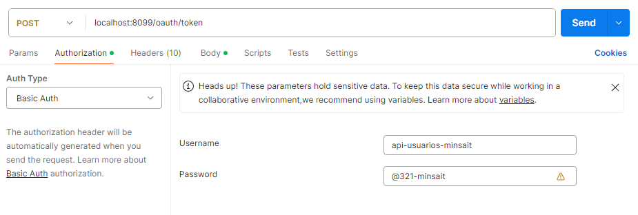
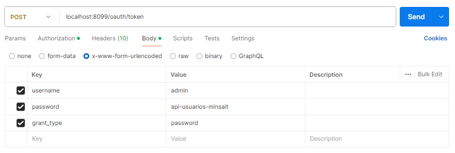
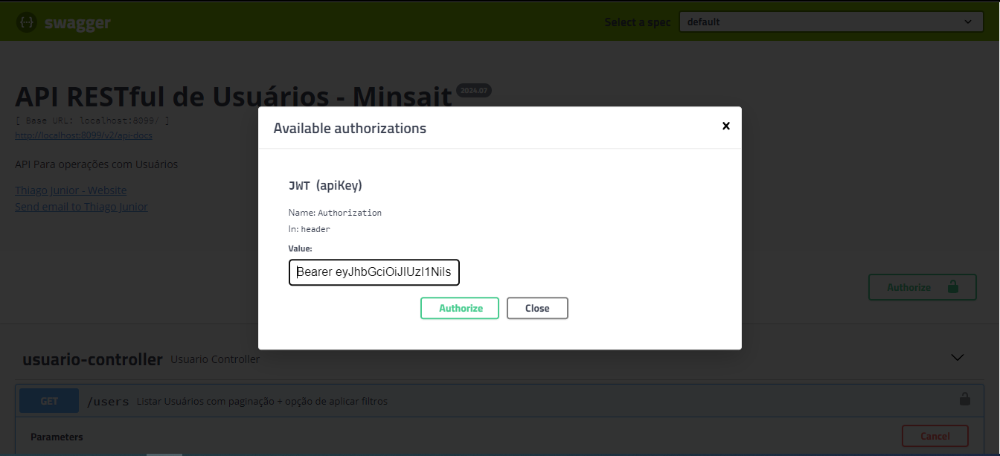
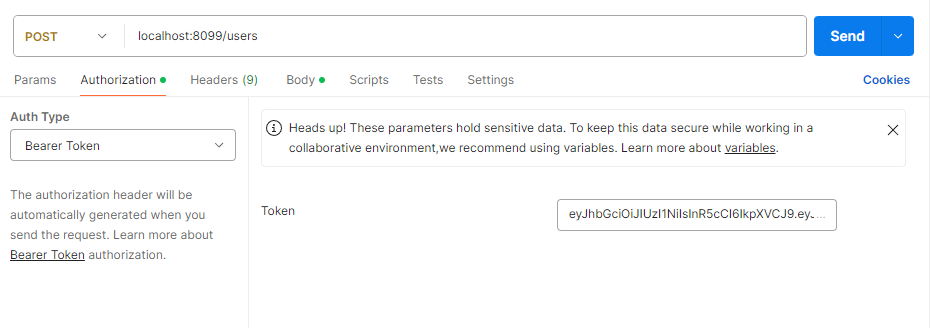

# Minsait - API de Usuários

* Java 11
* Maven 3.9.6
* PostgreSQL 15
* Spring Security + OAuth2 Para autenticação com JWT
* A API foi desenvolvida de acordo com os princípios SOLID.
* CI/CD Jenkins/Sonar para análise contínua de código + testes unitários + Deploy Docker.
* Flyway para migração / versionamento do banco de dados + Criar cargas iniciais;

### Execução de Testes unitários LOCALHOST:

* Para executar os testes unitários localmente, é necessário configurar o JDK e o maven nas
  variáveis ambiente do sistema;
* Acesse a pasta raiz do projeto 'api-usuarios-minsait' e execute o comando:  mvn verify
* O mvn verify executará os testes unitários, Esse comando também cria a pasta 'target'.
* O relatório de teste do jacoco será gerado após o comando acima no
  caminho: target\site\jacoco\index.html
* Também é possível acessar o resultado de testes no sonar. Esse projeto está configurado
  com CI/CD Jenkins + Sonar para análise contínua de código + Deploy docker.
  Para verificar o relatório de testes no
  SONAR:  [http://cloudtecnologia.dynns.com:9000/dashboard?id=api-usuarios-minsait](http://cloudtecnologia.dynns.com:9000/dashboard?id=api-usuarios-minsait)

### Subindo o projeto em LOCALHOST:

* É necessário possuir o DOCKER.
* Na pasta raiz do projeto: 'api-usuarios-minsait' execute o comando: docker compose up -d --build
* Esse comando subirá o container do banco de dados do sistema e o próprio sistema.
* Após subir o projeto localmente, será possível acessar a documentação da API - Swagger através
  da URL: [http://localhost:8099/swagger-ui.html](http://localhost:8099/swagger-ui.html)

### Consumindo a API:

* Para consumir a API através do Swagger ou POSTMAN, será necessário obter o TOKEN JWT.
* A url para obtenção dos tokens: [http://localhost:8099/oauth/token](http://localhost:8099/oauth/token)
* O Verbo HTTP é: POST
* Deverá ser passado o Header Authorization como Basic Auth,
  o Username é: api-usuarios-minsait
  o Password: @321-minsait
* No BODY, deverá ser passado como x-www-form-urlencoded os seguintes parametros:
* username: admin
* password: api-usuarios-minsait
* grant_type: password
* Exemplo de obtenção do TOKEN via POSTMAN:
  
  
* Após obter o token JWT, será possível consumir a API passando em todas as requisições POSTMAN
  ou no Swagger o TOKEN Jwt no Header Authorization.
* Exemplo de Autenticação no Swagger com o TOKEN obtido, basta informar no campo
  o token JWT, informe assim:  Bearer meu-token-jwt:
* Exemplo:
  
* Após autorização todos os endpoints estarão disponíveis para uso no SWAGGER.
* Para realizar requisições na API via postman é necessário informar o token obtido,
  para passar otoken no Header como Authorization no POSTMAN:
  

### Informações sobre endpoins / funcionalidades da API:

* Para ter acesso as operações de Create/Read/Update/Delete
  Acesse a documentação swagger: [http://localhost:8099/swagger-ui.html](http://localhost:8099/swagger-ui.html)
* A documentação fornecerá as informações necessárias para que seja consumida a API de forma correta.

### CI/CD Jenkins + Sonar

* A branch 'master' desse projeto está configurada para que sejam executados os testes unitários
  e publicado o resultado no
  SONAR:  [http://cloudtecnologia.dynns.com:9000/dashboard?id=api-usuarios-minsait](http://cloudtecnologia.dynns.com:9000/dashboard?id=api-usuarios-minsait)

* Também é possível verificar a análise de qualidade de código.
* Além dos testes unitários o Jenkins faz o deploy da API em um servidor docker.
* A API também poderá ser acessada nesse
  servidor:  [http://cloudtecnologia.dynns.com:8099/swagger-ui.html](http://cloudtecnologia.dynns.com:8099/swagger-ui.html)